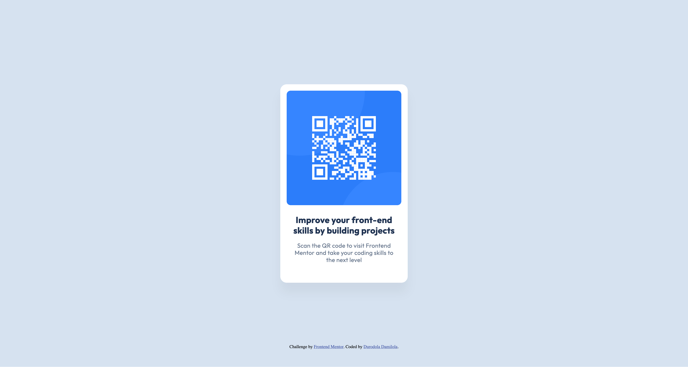

# Frontend Mentor - QR code component solution

This is a solution to the [QR code component challenge on Frontend Mentor](https://www.frontendmentor.io/challenges/qr-code-component-iux_sIO_H). Frontend Mentor challenges help you improve your coding skills by building realistic projects. 

## Table of contents

- [Overview](#overview)
  - [Screenshot](#screenshot)
  - [Links](#links)
- [My process](#my-process)
  - [Built with](#built-with)
  - [What I learned](#what-i-learned)
  - [Useful resources](#useful-resources)
- [Author](#author)
- [Acknowledgments](#acknowledgments)

**Note: Delete this note and update the table of contents based on what sections you keep.**

## Overview

### Screenshot

### Links

- Github: [Add solution URL here](https://github.com/shrewdmind/qr-component)
- Live Site URL: [Add live site URL here](https://shrewdmind-qr-component.netlify.app/)

## My process

### Built with

- Semantic HTML5 markup
- CSS custom properties
- Flexbox
- CSS Grid

### What I learned

- Semantic HTML
- When to use CSS grid or flex
- Read about CSS shadows (box-shadow, text-shadow and drop-shadow)

### Useful resources
- [CSS Grid](https://web.dev/learn/css/grid)
- [CSS Flexbox](https://web.dev/learn/css/flexbox)
- [CSS Shadows](https://web.dev/learn/css/shadows)

## Author

- Frontend Mentor - [@shrewdmind](https://www.frontendmentor.io/profile/shrewdmind)
- Twitter - [@john_durodola](https://x.com/johndurodola_)

## Acknowledgments

Shout out to [@joshteflon_](https://github.com/JoshTeflon) who gave me some tips when I got stuck with aligning items
